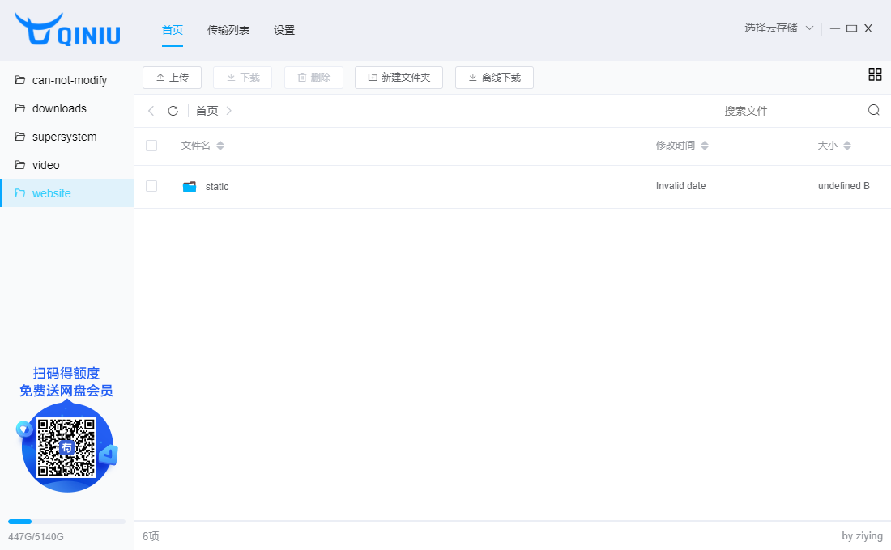
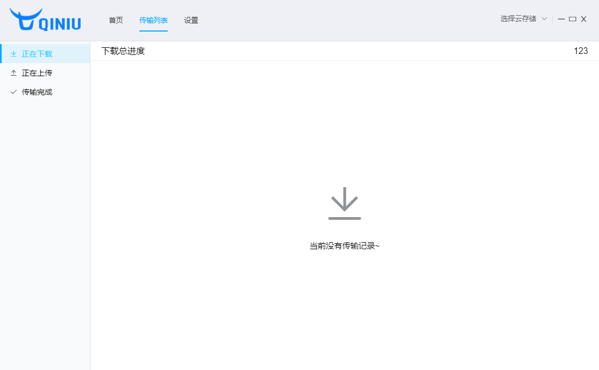
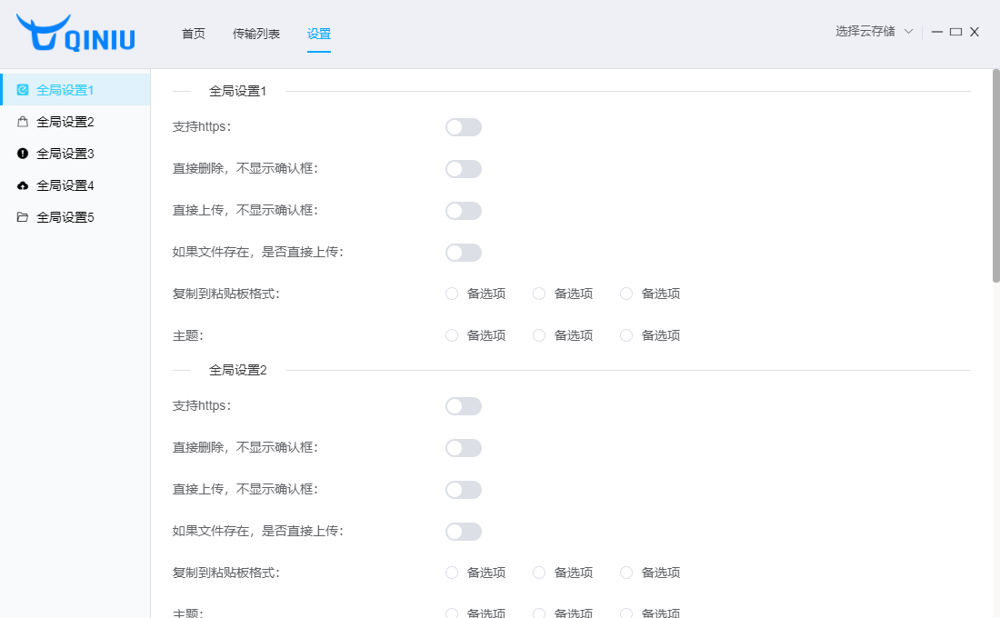

# OSS 云存储

> 七牛云文件仿百度网盘文件夹管理，上传下载，删除

### 功能简介

1. 仿百度网盘（有悬浮窗）
2. 拖拽上传（现只能单个文件，或者多个文件上传，不能直接上传文件夹）
3. 下载进度
4. 托盘图标
5. 右键菜单

### 界面样式截图

- 首页
    

- 传输列表
    

- 设置
    
    
### 下载链接(v0.0.1)

[win](http://soft.super-system.top//云存储客户端%20Setup%200.0.1.exe)

[mac](http://soft.super-system.top//云存储客户端-0.0.1.dmg) 
